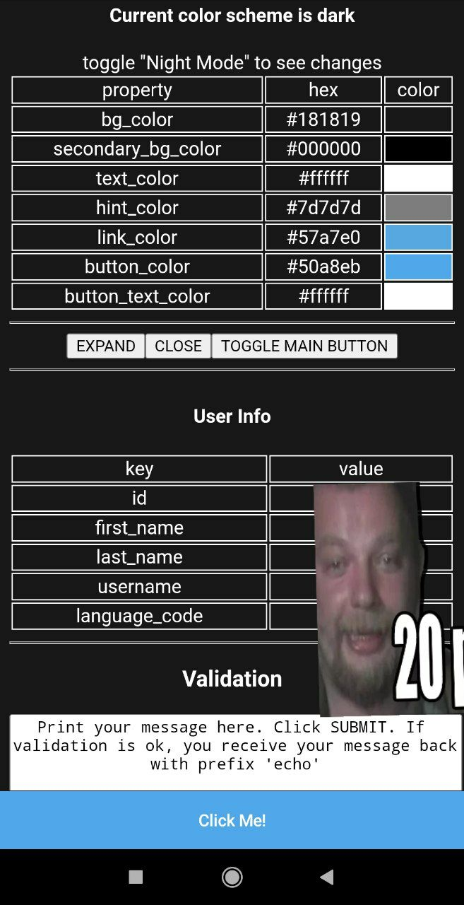

# Telegram Bot Boilerplate

A starting point to develop Web Apps inside Telegram with next technology stack:

* expressjs
* react
* webpack

:warning: **Current project state**: Under construction

## ToDo

- [ ] make test for production mode
- [ ] add autorestart local develop server

For development, you will only need Node.js installed on your environement.
And please use the appropriate [Editorconfig](http://editorconfig.org/) plugin for your Editor (not mandatory).

## Install & Configure

    $ git clone git@github.com:crocodeev/noSilenceBot.git
    $ cd ./TelegramBotBoilerPlate
    $ npm i
    $ touch .env

listin of .env

    > TELEGRAM='bot token'
    > NGROK='ngrok token'
    > PORT='local port'

As WebApp in Telegram need https protocol instead of http, ngrok is good solution to manage this. 

Ngrok made tunnel https > your local server
Need to login at https://ngrok.com/ and get token.

## Start

### NPM Commands

* "https-fwd" - https forwarding
* "build:dev" - build front and back in development mode
* "build:prod" - build front and back in production mode
* "build:dev-server" - buuild dev server only
* "start" - run server
* "dev:server" - for local develop only
* "dev:tg" - for test in telegram

When you run "dev:tg" in console:

    $ [0] Your develop url from ngrok is 
    $ [0] https://0000-0-000-00-000.ngrok.io

Copy adress and paste to Menu Button Settings at BotFather    

### Demo of Telegram WebApps features

* color scheme
* 'themeChanged' event
* userInfo
* expand method
* close method
* Main Button
* Popup
* Request validation

